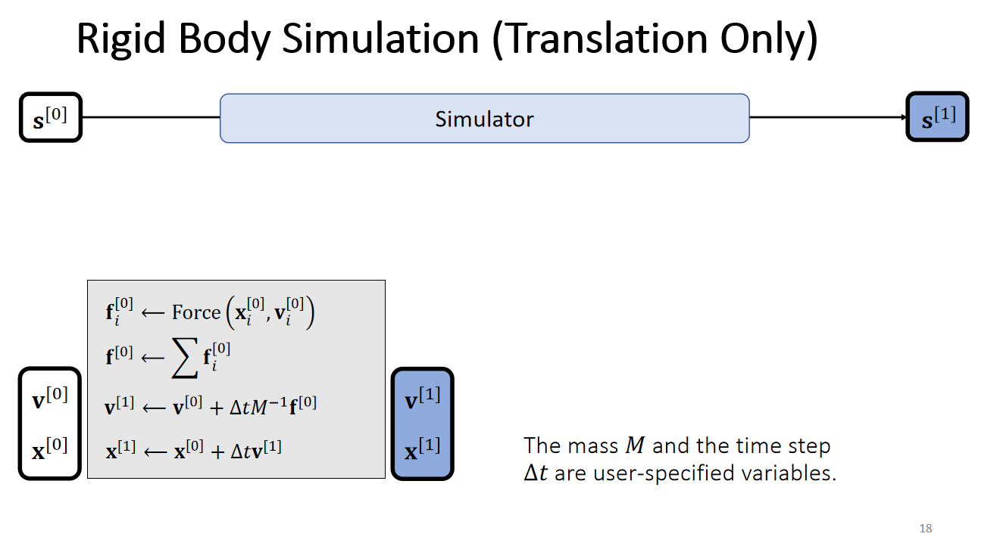
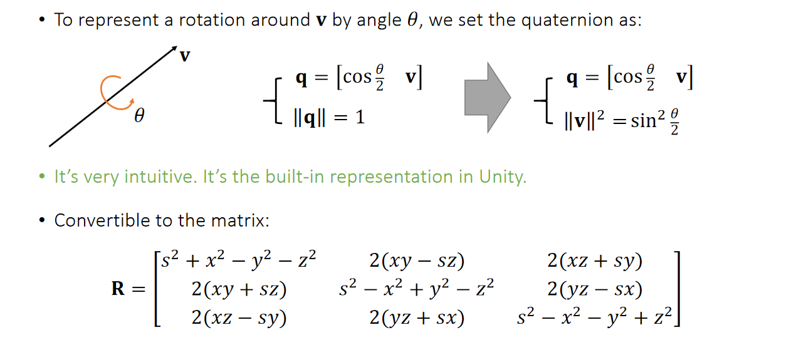
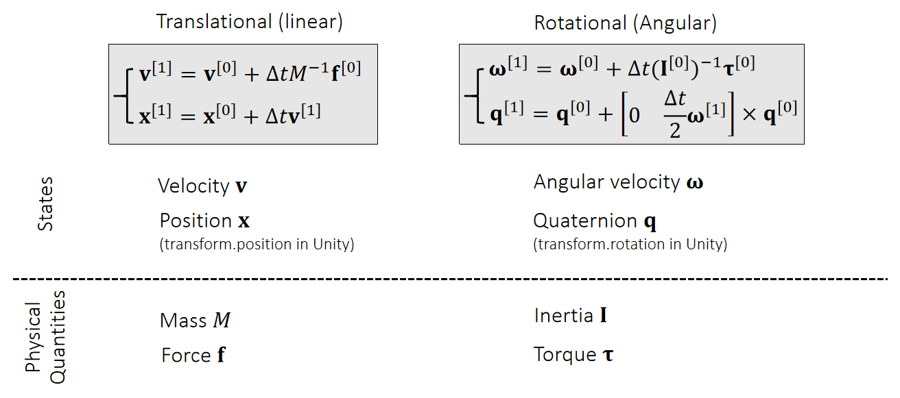

Rigid 刚体。

刚体不可变形，它的运动就可以看作两部分：平移和旋转。

### Translation

前面说了一大堆误差啥的，没看懂。

需要给出：质量、力。计算得到：速度、位置。

### Rotational

使用矩阵表示旋转：方便计算但是不直观。

使用欧拉数表示：直观但是可能出现万向锁。

使用 Quaternion 四元数表示：一个数和一个三维向量组成，表示绕着这个向量旋转多少度。

四元数各种计算的定义：

具体表示：

需要给出：Inertia 惯量（对应质量）、Torque 力矩（对应力）。计算得到：$\omega$ 角速度（对应速度）、Quaternion 四元数（对应位置）。

上图就是更新的过程，实际计算的过程中用不着区分不同时刻的值，直接计算就好。

### Particle Collision Detection and Response 单点检测响应

#### Penalty Methods 

距离函数定义：一个点到一个物体表面的最近距离，如果在物体外就是正值，如果在物体内就是负值。

* 几个不同物体的距离函数的计算。
* 不同物体相交、相并之后的距离函数的计算。

Quadratic Penalty Methods: 碰撞（距离函数小于零）就给出一个倾向于远离的力，下一个时刻起作用。

* 原版：$\bf f = - \it k \phi(\bf x) N $​ ，k 是一个系数，N 是距离函数的梯度，感觉也可以说是表面法向量的梯度。一定会发生穿模。
* 带缓冲：当距离函数小于一定值是就施加一个力。$\bf f = - \it k (\epsilon - \phi(\bf x)) N$​ 。并不能完全避免穿模。
* Log-Barrier Penalty Method：假设距离函数永不为负。$\bf f = \rho \frac{1}{\phi(\bf x)} N$ 。

#### Impulse Methods

如果发生距离函数小于零的情况，则：把新的位置改变到最近的表面上。同时也要改变速度，如果法向速度和距离向量的梯度同向则不用管，如果反向则：把法向速度反向并乘一个系数 $\mu_T$，并且把切向速度也乘一个系数 $a$。

（这里有关于 $\mu_T$ 和 $a$ 的关系讨论，没看懂）

### Rigid Collision Detection and Response by Impulse 

### Shape Matching 

